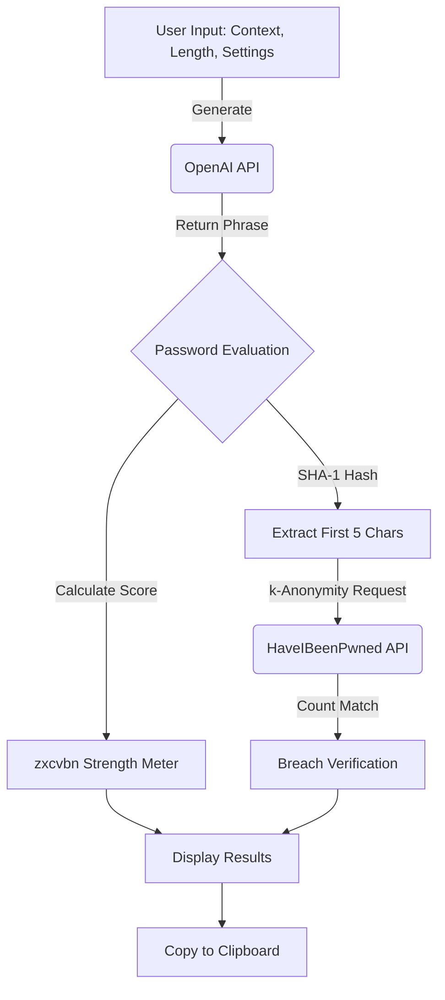

 🔐 AI PassGen
> Context-smart passwords that beat credential stuffing.

**AI PassGen** is a modern, secure, and intuitive web application designed to generate memorable phrase-style passwords using the power of OpenAI. Built with Streamlit, it emphasizes security (zero client storage, client-side SHA-1 hashing) and modern UI/UX design (glassmorphism, dark/light modes). Created by Smiso Ndwandwe.

## 🌟 Features
- **Context-Aware Generation**: Create passwords tailored to specific use cases (e.g., "work email", "banking PIN") making them easier to remember.
- **Local Secure Fallback Mode**: If the OpenAI API key is missing or the network is down, the app automatically switches to generating cryptographically secure local passwords using Python's `secrets` module—never crashing.
- **Enterprise-Grade Security Analysis**: Calculates password entropy, estimates offline cracking time using `zxcvbn`, and provides a 0-4 strength score.
- **Breach Detection**: Cross-references generated passwords securely with the **HaveIBeenPwned API** using k-Anonymity (only the first 5 characters of the SHA-1 hash are sent).
- **Modern UI/UX**:
  - Responsive Mobile-First Design
  - Glassmorphism & Neumorphic Elements
  - Seamless Dark/Light Mode toggle
  - Micro-animations (e.g., Confetti burst on strong passwords)
  - Copy-to-clipboard functionality via Streamlit native components

## 🛠 Tech Stack
- **Python 3.12**
- **Streamlit**: Core UI Framework
- **OpenAI API**: Context-aware password generation (`gpt-3.5-turbo`)
- **HaveIBeenPwned API**: Breach checks via `requests`
- **zxcvbn-py**: Advanced password strength estimation
- **streamlit-extras**: UI micro-animations

## 🏗 Architecture Flow



## 🚀 Getting Started

### Prerequisites
- Python 3.10+
- OpenAI API Key

### Installation

1. **Clone the repository**
   ```bash
   git clone https://github.com/yourusername/ai-password-generator.git
   cd ai-password-generator
   ```

2. **Set up a virtual environment**
   ```bash
   python -m venv venv
   source venv/bin/activate  # On Windows: venv\Scripts\activate
   ```

3. **Install dependencies**
   ```bash
   pip install -r requirements.txt
   ```

4. **Environment Variables**
   Create a `.env` file in the root directory by copying `.env.example`:
   ```bash
   cp .env.example .env
   ```
   Add your OpenAI API key to the newly created `.env` file:
   ```env
   OPENAI_API_KEY=your-api-key-here
   ```

5. **Run the App**
   ```bash
   streamlit run app.py
   ```

## 🔒 Security Principles
- **No Persistence**: Passwords are saved temporarily in the Streamlit session state and disappear upon refresh/closing the tab.
- **k-Anonymity Check**: The app hashes the password locally, and *only* sends the first 5 characters of the hash to the HIBP API. The full password never leaves the machine for validation.
- **No Logging**: No server logs or external analytics are connected.

## 📄 License
MIT License - Ethical use only.
